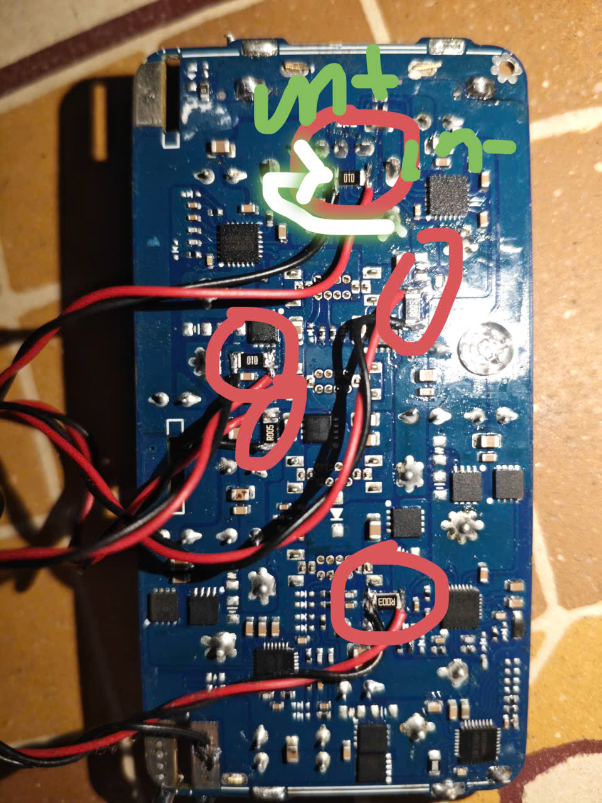
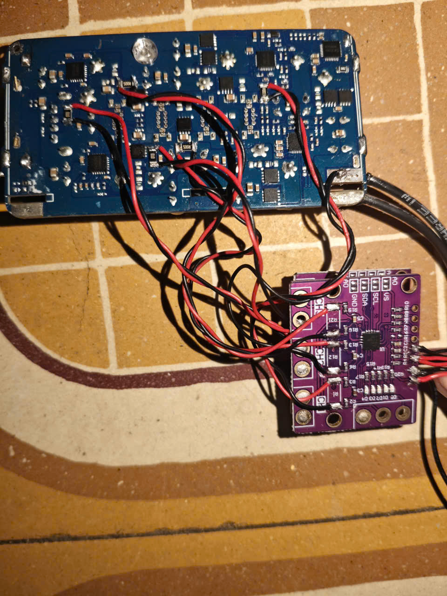

# Hướng dẫn kết nối INA3221 với mạch UGREEN 300W

## 1. Tham khảo sửa mạch INA3221
- Link: [Fixing the INA3221 breakout board - Arduino Forum](https://forum.arduino.cc/t/fixing-the-ina3221-breakout-board/526947)  
- Thực hiện theo hướng dẫn trong link, **tháo bỏ 3 điện trở shunt (Rshunt) mặc định trên module INA3221**.

---

## 2. Sơ đồ kết nối (SCHEMATIC)

### Phần cứng UGREEN 300W
- Tháo phần sau của mạch UGREEN 300W.  
- Tìm các điện trở shunt to, ký hiệu: **R003, R005, R010**.  
- Kết nối mạch INA3221 vào các Rshunt:  
  - **Đầu nối với cuộn cảm → IN+**  
  - **Đầu còn lại → IN-**  
- Chỉ sử dụng **CH1, CH2** (CH3 có thể bị lỗi, nếu cần thì thay bằng **INA226**, cách làm tương tự).

  

---

### Kết nối ESP32
- **SDA, SCL (INA3221 + OLED)** → **GPIO 21, 22**  
- **VCC (5V) INA3221** → **5V/Vin ESP32**  
- **GND** → nối chung với ESP32 và mạch nguồn  

  

---

## 3. Phần mềm
- **App build sẵn (Android):** `release/app-release.apk`  
- **Source code (Flutter):** `app/lib/main.dart`
