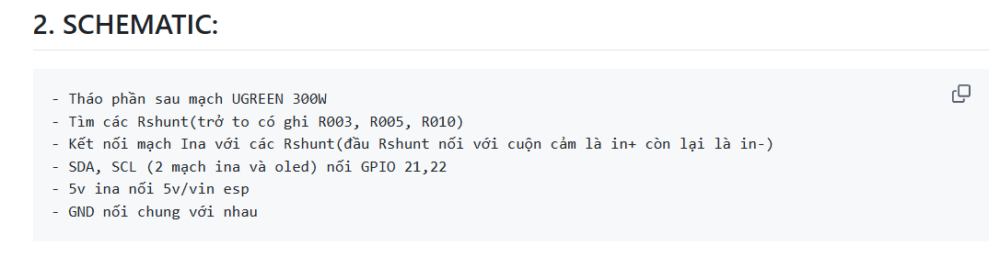

## **1. [Fixing the INA3221 breakout board - Arduino Forum](https://forum.arduino.cc/t/fixing-the-ina3221-breakout-board/526947)**
Làm theo link trên, thêm bước tháo 3 R shunt đi
## **2. SCHEMATIC:**
- Tháo phần sau mạch UGREEN 300W
- Tìm các Rshunt(trở to có ghi R003, R005, R010)
- Kết nối mạch Ina với các Rshunt(đầu Rshunt nối với cuộn cảm là in+ còn lại là in-)
- SDA, SCL (2 mạch ina và oled) nối GPIO 21,22
- 5v ina nối 5v/vin esp
- GND nối chung với nhau

## **App build sẵn:** release\app-release.apk
code dùng flutter

## **Getting Started**
This project is a starting point for a Flutter application.

A few resources to get you started if this is your first Flutter project:

Lab: Write your first Flutter app
Cookbook: Useful Flutter samples
For help getting started with Flutter development, view the online documentation, which offers tutorials, samples, guidance on mobile development, and a full API reference.

